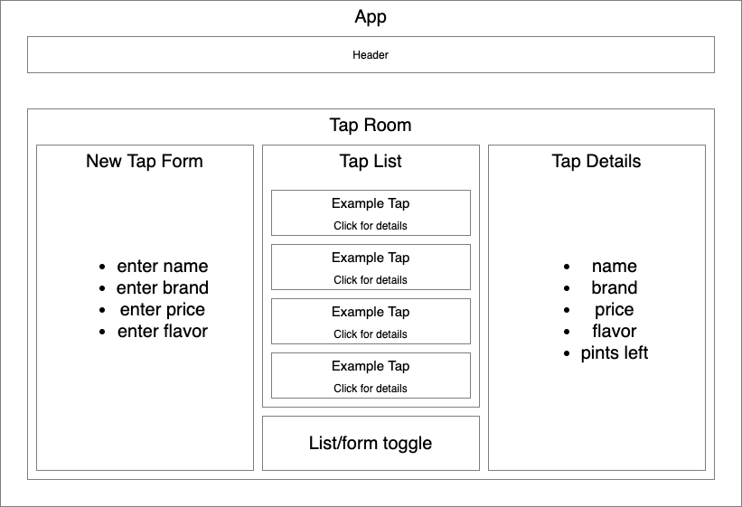

# Noel's Kombucha Bar

## By Noel Kirkland - 9/11/2020

## Description
This is a web application that helps a kombucha bar owner keep track of the kombucha that currently have on tap as well as how many pints are left in each keg. The application allows the user to add a keg of kombucha with details like, name, brand, price per pint, and flavor profile. The user can see a list of all the kombucha kegs they have added. The user can then click on any of the list kegs to see that kombucha's details. The user can also click a button to sell a single pint or enter a custom amount of pints they have sold  and they will see the total pints left in the keg decrease.

## User stories
* As a user, I want to see a list/menu of all available kegs. For each keg, I want to see its name, brand, price, and flavor profile.
* As a user, I want to submit a form to add a new keg to a list.
* As a user, I want to be able to click on a keg to see its detail page.
* As a user, I want to see how many pints are left in a keg.
As a user, I want to be able to click a button next to a keg whenever I sell a pint of it and see the total pints left decrease by one.
* As a user, I want to be able to enter how many pints of I have sold from a particular keg and see that accurately reflected in that keg's total pints left. Pints should not be able to go below 0.

## Component Diagram

## Setup/Installation Requirements

* Download from GitHub
  1. _Open the following web address in your browser:
`https://github.com/NoelKirkland`_
  2. _Click on the button labeled_ Repositories
  3. _Navigate into the `noel-s-kombucha-bar` repository and click the green button labeled_ Clone or download.
  4. _Open the directory and double click the `index.html` file to have it open in your default browser_

* Download by Cloning
  1. _Open the following web address in your browser:
`https://github.com/NoelKirkland`_
  2. _Click on the button labeled_ Repositories
  3. _Navigate into the `noel-s-kombucha-bar` and click the green button labeled_ Clone or download.
  4. _Open the directory in your preferred text-editor_
  5. _Open the `index.html` file in your preferred browser_

* Open and Run Application
  1. _Open the downloaded application in a text editor ([V.S. Code preferred](https://code.visualstudio.com/))_
  2. _Open a new terminal in your text editor (Ctrl+\` in V.S. Code) and run command `> npm install`_
  3. _Start the local server by running the command `> npm start`_
  4. _Visit the address http://localhost:3000/ in your preferred browser_
  5. Have fun!

## Known Bugs

_There are no known bugs at this time_

## Support and contact details

_If you run into any problems, or have any questions at all, feel free to reach out to me at noelkirkland@gmail.com_

## Technologies Used

_This webpage was constructed using HTML, JSX, Javascript, and REACT_

### License

*This project uses the following license: [MIT](https://opensource.org/licenses/MIT)

Intellectual property of Noel R. Kirkland - 2020